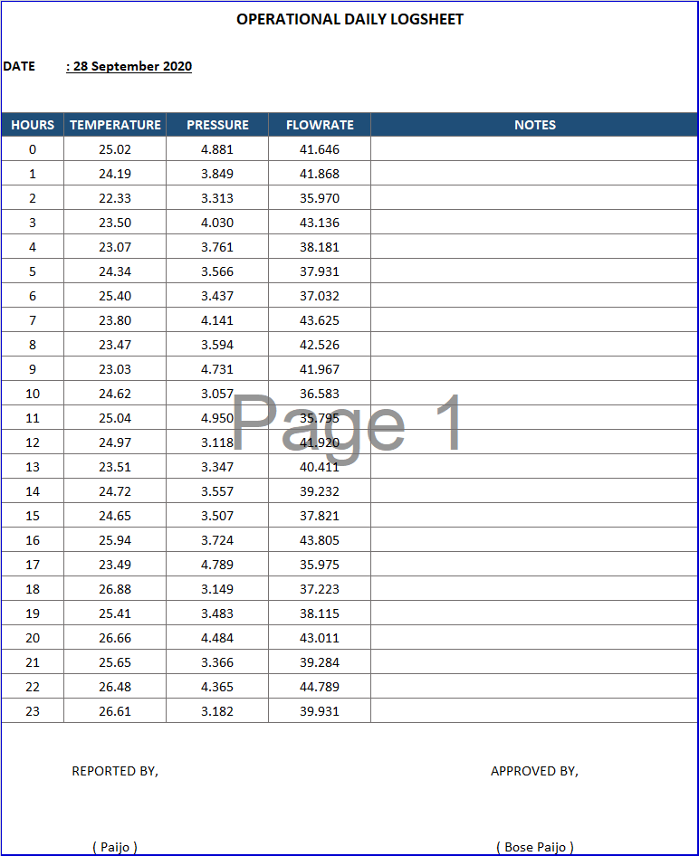

# Go Exceler

Small tool to generate excel file based on given template (excel) and data to be written.

## Install

Install the package with the following command:

> go get github.com/annlumia/go-exceler

## Using package

Create template in excel file like :


and save as `template.xlsx`.

Paste the following code to your go file:

```go

package main

import (
	"math/rand"
  "time"

  // 1. Import package
	exceler "github.com/annlumia/go-exceler"
)

func main() {
  // 2. Create new report basend on excel file and name of sheet
	r, err := exceler.NewFromFile("./template.xlsx", "Sample")
	if err != nil {
		panic(err)
  }

  // Data to be written to the template
	data := map[string]interface{}{
		"operator": "Paijo",
		"approver": "Bose Paijo",
		"date":     time.Now().Format("02 January 2006"),
  }

  // Generate table data
	measurements := make([]interface{}, 24)
	for i := 0; i < len(measurements); i++ {
		measurements[i] = map[string]interface{}{
			"hour":        i,
			"temperature": rand.Float64()*5 + 22,
			"pressure":    rand.Float64()*2 + 3,
			"flowrate":    rand.Float64()*10 + 35,
		}
  }

  // Data
  data["data"] = measurements

  // 3. Render data
  r.Render(data)
  // 4. Save result
	r.Save("Generated_report.xlsx")
}

```

Run the code, and what you will get is



## Contribution wantend

If you are interested in this project and wish you had better features, please submit a feature request.

Contributions to the development of this project are welcome.
